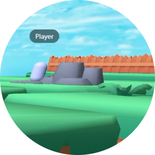

<h1 align="center">Salut je suis liloulap</h1>
<h3 align="center">Un developeur français passioné</h3>

	
	 
	 

**J'adore le code**&nbsp;&nbsp;&nbsp;&nbsp;**et les chats**&nbsp;&nbsp;

      
      
      

## 🖐️ A propos de moi
- Je suis un jeune dévelopeur **PASIONE** 
- J'adore **les chats**
- J'adore les **jeux vidéos, la musique et le developement**.
- 🌐 Portfolio: [www.liloulap.fr](https://www.liloulap.fr/)
- Je parle : Anglais et Français

## 💻 Projets

| Media | Nom | Description | Lien |
| :---: | :--- | :--- | :--- |
|  | **Woob2K** | Une **activité discord/jeu web** fait en 3d.  | Projet Privé (pour l'instant) |
| <a>Aucun Media</a> | **Bot Modulable** | Un bot modulable... Rien de plus | [Repo](https://github.com/liloulap66/Bot-Modulable) |

## 🛠️ Tech Stack & Tools

         
##
<picture>

  
</picture>

##

